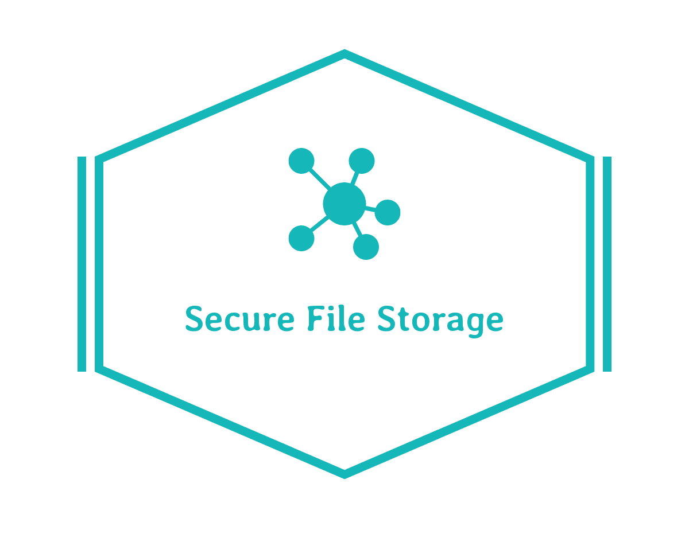
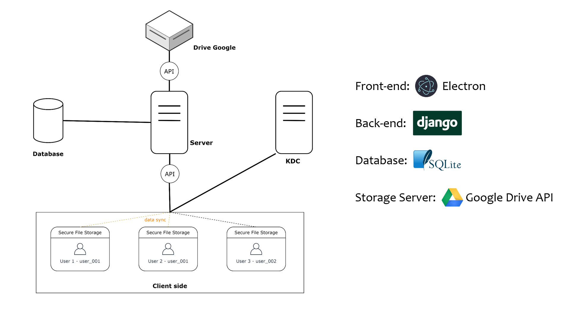

# Secure File Storage

A **secure** and **easy-to-use** File Manager Application

---

**Secure File Storage** là phần mềm lưu trữ và bảo vệ các tập tin quan trọng của người dùng một cách đơn giản và nhanh chóng. Hỗ trợ bảo mật với khả năng mã hóa các dữ liệu, cung cấp tài khoản riêng biệt giúp bảo vệ cũng như tạo một môi trường lưu trữ an toàn cho các tập tin của người dùng.

- [Giới thiệu](#giới-thiệu)
- [Mô tả hệ thống](#mô-tả-hệ-thống)
- [Tính năng](#tính-năng)
- [Cài đặt](#cài-đặt)
- [Screenshot](#screenshot)

---
  

## Giới thiệu

Secure File Storage là phần mềm có khả năng cung cấp cho người dùng một két sắt bảo mật, là môi trường lý tưởng để bảo vệ các dữ liệu quan trọng của người dùng mà không ai có thể xâm phạm. Chỉ cần cài đặt trực tiếp phần mềm này vào máy tính. Tất cả những dữ liệu sẽ được mã hóa. Phần mềm này cung cấp một phương pháp đơn giản mà hiệu quả để bảo vệ những dữ liệu riêng tư và nhạy cảm của người dùng. 

Phần mềm cho phép người dùng có thể thêm tập tin muốn mã hóa bằng thao tác vô cùng đơn giản chỉ với việc kéo thả tập tin vào phần mềm. Ngoài ra phần mềm cho phép người dùng thực hiện các thao tác với tập tin như: xem nội dung tập tin, sửa nội dung, xóa tập tin, tải tập tin, phân loại, tìm kiếm, sắp xếp, khóa màn hình, xem lịch sử các thiết bị đăng nhập, điều này giúp người dùng có thể biết được dữ liệu có bị truy cập trái phép hay không. Không chỉ có vậy, phần mềm còn hỗ trợ đồng bộ dữ liệu lên máy chủ, giúp cho người dùng có thể truy cập dữ liệu ở bất kì đâu bất kì thiết bị nào.

## Tính năng

+ Quản lý đăng nhập
	+ Đăng kí
	+ Đăng nhập
	+ Đăng xuất
	+ Quên mật khẩu
	+ Khóa màn hình
+ Quản lý tập tin
	+ Thêm tập tin
	+ Xem tập tin
	+ Sửa nội dung tập tin
	+ Tải tập tin 
	+ Xóa tập tin
	+ Quản lý thư mục
	+ Xem lịch sử
	+ Phân loại tập tin
	+ Tìm kiếm tập tin
	+ Sắp xếp tập tin
	+ Chia sẻ tập tin

+ Quản lý tài khoản 
	+ Xem thông tin tài khoản
	+ Sửa thông tin tài khoản
	+ Đổi mật khẩu

+ Đồng bộ dữ liệu

+ Thống kê

+ Xem lịch sử của các thiết bị

+ Xem thông tin phần mềm

## Mô tả hệ thống

### Đối tượng tham gia

**Client side**

+ Mô tả: Phần mềm phía người sử dụng

+ Công nghệ sử dụng: **Electronjs**

+ Vai trò: 
    + Giúp người dùng sử dụng các tính năng của phần mềm (đã nêu trên).
    + Giao tiếp với server side thông qua API của 
    \<server> và \<KDC>.

**Server**

+ Mô tả: Máy chủ chính thực hiện các thao tác đồng bộ dữ liệu, quản lý dữ liệu người sử dụng và xử lý việc đăng nhập, đăng kí của người sử dụng.

+ Công nghệ sử dụng: **Django**.

+ Vai trò: 
    + Xử lý các request của người dùng về việc đồng bộ dữ liệu (các thao tác về tập tin như: thêm, sửa, xóa tập tin và các thao tác về thư mục).
    + Quản lý các dữ liệu người sử dụng bao gồm: thông tin tài khoản, lịch sử truy cập của các thiết bị.
Xử lý các thao tác đăng nhập, đăng kí của người sử dụng.

**Database**

+ Mô tả: Cơ sở dữ liệu lưu trữ thông tin của người dùng.

+ Công nghệ sử dụng: **SQLite**.

+ Vai trò: 

    + Lưu trữ thông tin về tài khoản và lịch sử truy cập các thiết bị.

**Storage Server**

+ Mô tả: Hệ thống lưu trữ tập tin mã hóa

+ Công nghệ sử dụng: Lưu trữ ở Google Drive và giao tiếp thông qua **Google Drive API**.

+ Vai trò:
    + Lưu trữ các tập tin mã hóa và cấu trúc thư mục dùng để đồng bộ dữ liệu trên các thiết bị khác nhau cùng một tài khoản.

## Cài đặt
Sẽ viết sau...
## Screenshot
